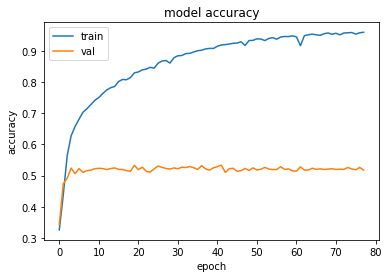
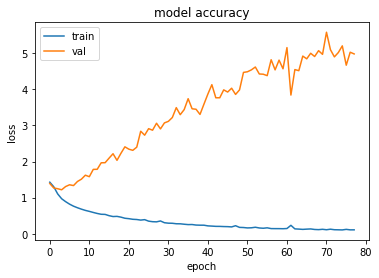

# **U.S. Patent Phrase to Phrase Matching Kaggle Competion**


### __This is kaggle machine learning challenge__

## 

---
#### Above notebooks are tensorflow deep learning models. It is a classification model which follows the concept of `Attention Transformers` since this is a natural language processing challenge.

---
### Model Summary

```
Model: "auto_encoder_model"
_________________________________________________________________
Layer (type)                 Output Shape              Param #   
=================================================================
positional_embedding (Positi multiple                  285984    
_________________________________________________________________
transformer (Transformer)    multiple                  50368     
_________________________________________________________________
positional_embedding_1 (Posi multiple                  286304    
_________________________________________________________________
transformer_1 (Transformer)  multiple                  50368     
_________________________________________________________________
dropout_4 (Dropout)          multiple                  0         
_________________________________________________________________
global_average_pooling1d (Gl multiple                  0         
_________________________________________________________________
global_average_pooling1d_1 ( multiple                  0         
_________________________________________________________________
dense_4 (Dense)              multiple                  8320      
_________________________________________________________________
dense_5 (Dense)              multiple                  8256      
_________________________________________________________________
dense_6 (Dense)              multiple                  4160      
_________________________________________________________________
dense_7 (Dense)              multiple                  2080      
_________________________________________________________________
dense_8 (Dense)              multiple                  528       
_________________________________________________________________
dense_9 (Dense)              multiple                  85        
=================================================================
Total params: 696,453
Trainable params: 696,453
Non-trainable params: 0
_________________________________________________________________
```

## __Model evaluation__

`Accuracy` [model version 2](model-v2.ipynb) met is plotted in the figure below
<p align="left">
    
</p>

`Loss` [model version 2](model-v2.ipynb) met is plotted in the figure below
<p align="left">
    
</p>
---

### __this models evaluations and accuracies are not good yet. still finding a perfect way to improve the last version__